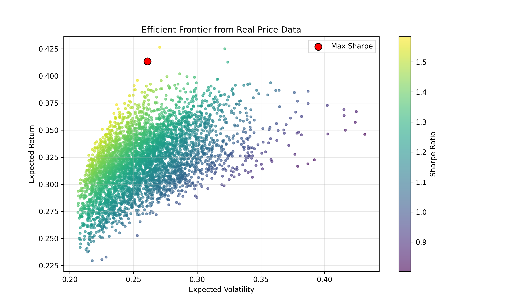

# 📈 Efficient Frontier


This project uses real daily prices for `AAPL`, `MSFT`, `GOOGL`, `AMZN`, and `TSLA`.
It tests many portfolio weight combinations and shows the risk-return tradeoff.

Reproduce output: run `python frontier.py` from this folder.

## ✨ Highlights

- ✅ Real market data (Yahoo Finance)
- ✅ Portfolio simulation with many weight combinations
- ✅ Max Sharpe portfolio marked on the chart

## 🔍 What it Does

- Downloads 3 years of adjusted close prices from Yahoo Finance.
- Computes annualized return and covariance from daily returns.
- Simulates many portfolio combinations.
- Plots the risk-return scatter and marks the max Sharpe portfolio.

## 📊 Output

<p align="center">
	
</p>

## ⚙️ Run

```bash
cd efficient_frontier
python frontier.py
```

Output image: `efficient_frontier_plot.png`

## 🗂️ Data Source

- Yahoo Finance via `yfinance`: https://ranaroussi.github.io/yfinance/

## ✅ Result & Learning

- **Result:** Simulated 4,000 portfolio allocations from real market data and selected the highest Sharpe-ratio mix as a practical risk-return benchmark.
- **Learning:** Small weight shifts can materially change return-volatility balance, reinforcing the value of diversification and disciplined allocation.

## ⚠️ Limitations

- Uses historical prices only and assumes recent behavior is informative.
- Does not include transaction costs, taxes, or changing risk-free rates.

## 📚 Reference

- [arXiv:1710.02435 — Sparse Portfolio Selection via the sorted ℓ1-Norm](https://arxiv.org/abs/1710.02435)
- [arXiv:2005.08703 — Reactive Global Minimum Variance Portfolios with k-BAHC covariance cleaning](https://arxiv.org/abs/2005.08703)
- [MIT OCW Lecture Library — 15.401 Video Lectures and Slides](https://ocw.mit.edu/courses/15-401-finance-theory-i-fall-2008/pages/video-lectures-and-slides/)
