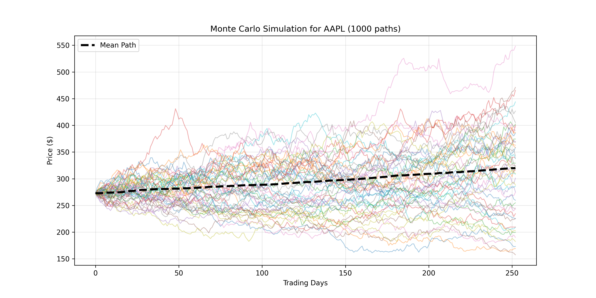
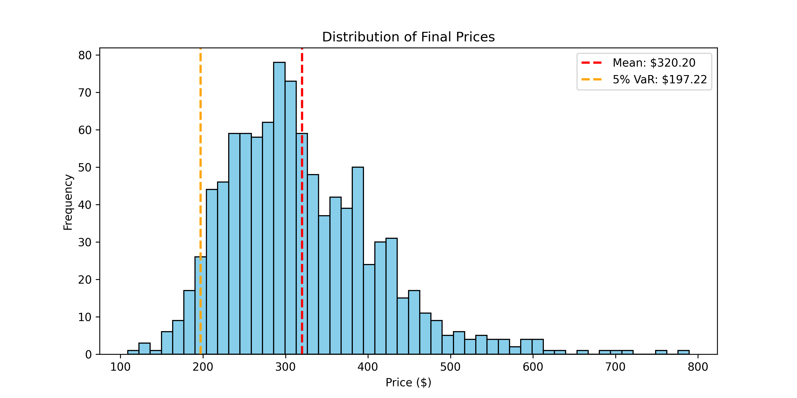

# 🎲 Monte Carlo Risk Simulation


This project uses real historical data for one stock (default `AAPL`).
It estimates drift and volatility from past returns, then runs a Monte Carlo simulation
for the next 252 trading days.

Reproduce output: run `python monte_carlo.py` from this folder.

## ✨ Highlights

- ✅ Real market data calibration
- ✅ 1,000 simulated future paths
- ✅ Final distribution with 5% tail level

## 🔍 What it Does

- Downloads 5 years of adjusted close prices from Yahoo Finance.
- Calculates log returns.
- Estimates annual drift (`mu`) and annual volatility (`sigma`).
- Simulates future price paths with Geometric Brownian Motion.
- Shows a path chart and final-price distribution, including a 5% tail level (VaR view).

## 📊 Output

### Simulated Paths
<p align="center">
	
</p>

### Final Price Distribution
<p align="center">
	
</p>

## ⚙️ Run

```bash
cd monte_carlo_sim
python monte_carlo.py
```

Output images:

- `monte_carlo_paths.png`
- `monte_carlo_dist.png`

## 🗂️ Data Source

- Yahoo Finance via `yfinance`: https://ranaroussi.github.io/yfinance/

## ✅ Result & Learning

- **Result:** Generated 1,000 Monte Carlo paths over a 252-day horizon and quantified downside exposure using the terminal distribution and 5th-percentile tail level.
- **Learning:** Framing outcomes as probability distributions, rather than single forecasts, improves risk awareness and expectation setting.

## ⚠️ Limitations

- Uses Geometric Brownian Motion, which simplifies real market behavior.
- Tail events can still be underestimated in highly volatile periods.

## 📚 References

- [arXiv:1504.02896 — Pricing and Risk Management with High-Dimensional Quasi Monte Carlo and Global Sensitivity Analysis](https://arxiv.org/abs/1504.02896)
- [arXiv:2209.14549 — Multilevel Monte Carlo and its Applications in Financial Engineering](https://arxiv.org/abs/2209.14549)
- [MIT OCW Lecture Library — 6.041SC Resource Index](https://ocw.mit.edu/courses/6-041sc-probabilistic-systems-analysis-and-applied-probability-fall-2013/pages/resource-index/)
