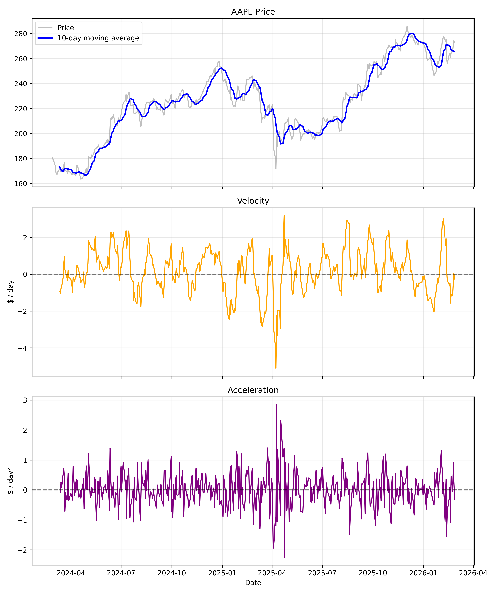

# 📉 Price Derivative Analysis


This project uses real stock prices (default `AAPL`) and computes
simple derivative-style signals from a moving average.

Reproduce output: run `python derivative_analysis.py` from this folder.

## ✨ Highlights

- ✅ Real stock data (Yahoo Finance)
- ✅ 10-day moving average smoothing
- ✅ Velocity and acceleration view for momentum shifts

## 🔍 What it Does

- Downloads 2 years of adjusted close prices from Yahoo Finance.
- Builds a 10-day moving average.
- Computes first difference as velocity.
- Computes second difference as acceleration.
- Plots price, velocity, and acceleration in one chart.

## 📊 Output

<p align="center">
	
</p>

## ⚙️ Run

```bash
cd price_derivative
python derivative_analysis.py
```

Output image: `derivative_analysis_plot.png`

## 🗂️ Data Source

- Yahoo Finance via `yfinance`: https://ranaroussi.github.io/yfinance/

## ✅ Result & Learning

- **Result:** Built a unified momentum view combining price, velocity, and acceleration from 2 years of AAPL data with a 10-day smoothing window.
- **Learning:** Changes in acceleration often appear before obvious price turning points, which helps frame earlier, risk-aware decision timing.

## ⚠️ Limitations

- Derivative signals can be noisy and should not be used alone.
- Moving-average window choice can change signal timing.

## 📚 References

- [arXiv:1904.04912 — Enhancing Time Series Momentum Strategies Using Deep Neural Networks](https://arxiv.org/abs/1904.04912)
- [arXiv:1702.07374 — Time series momentum and contrarian effects in the Chinese stock market](https://arxiv.org/abs/1702.07374)
- [MIT OCW Lecture Library — 18.01SC Differentiation Unit](https://ocw.mit.edu/courses/18-01sc-single-variable-calculus-fall-2010/pages/1.-differentiation/)
